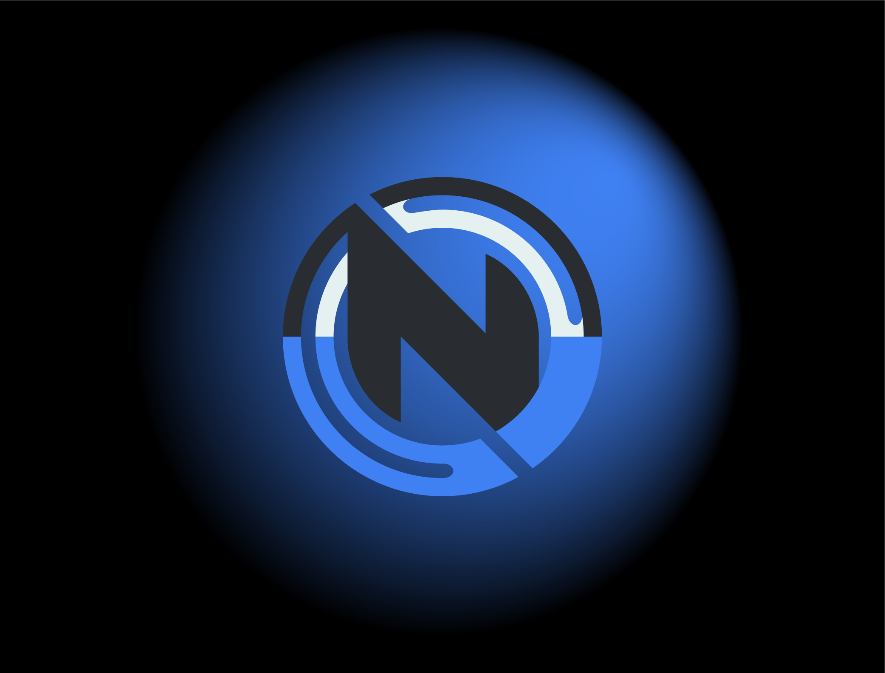

# 🌐 Novelex Consulting LLC Website 

Welcome to the **Novelex Consulting LLC Website** repository! This project is a Next.js application built to represent Novelex Consulting LLC's professional services. Designed for a polished, user-friendly experience, this website highlights the firm's expertise, service offerings, and unique approach in the consulting industry.

https://github.com/user-attachments/assets/bdb54a99-603e-4818-abf8-1c2d065dcbc2

## 📖 About

The Novelex Consulting LLC website showcases the company's strengths with a responsive design and clean layout, developed to provide potential clients with a smooth browsing experience. From an engaging homepage to detailed service sections, every element is crafted to reflect Novelex Consulting’s professionalism and client-centered approach.

## ✨ Features

- **Modern User Interface**: A clean and sophisticated design that aligns with Novelex Consulting’s brand.
- **Responsive Design**: Optimized for both desktop and mobile viewing.
- **Service Highlights**: Clear, structured sections dedicated to the company’s consulting expertise and service areas.
- **SEO-Optimized**: Enhanced search engine visibility with server-side rendering (SSR) provided by Next.js.
- **Fast Performance**: Efficient load times and optimized resource usage through Next.js's built-in optimizations.
